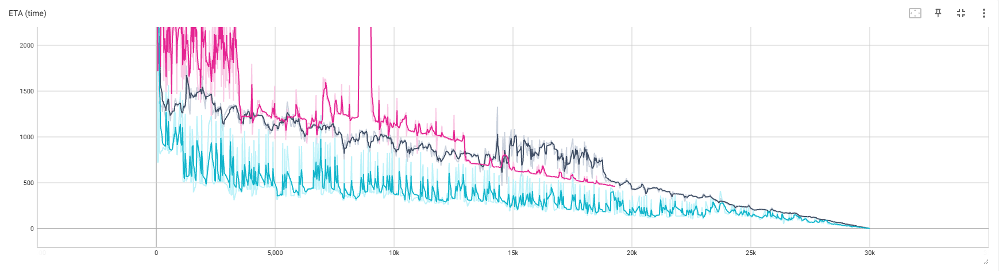
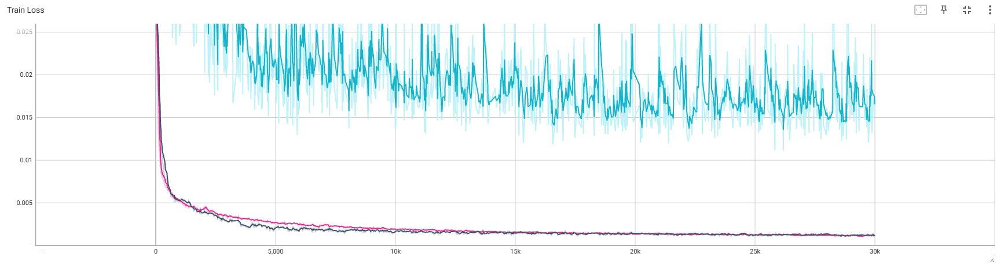

<p align="center">
    <!-- pypi-strip -->
    <picture>
    <source media="(prefers-color-scheme: dark)" srcset="https://docs.nerf.studio/_images/logo-dark.png">
    <source media="(prefers-color-scheme: light)" srcset="https://docs.nerf.studio/_images/logo.png">
    <!-- /pypi-strip -->
    
    <!-- pypi-strip -->
    </picture>
    <!-- /pypi-strip -->
</p>

# Quickstart

## 1. Installation: Setup the environment

### Prerequisites

You must have an NVIDIA video card with CUDA installed on the system. This library has been tested with version 11.8 of CUDA. You can find more information about installing CUDA [here](https://docs.nvidia.com/cuda/cuda-quick-start-guide/index.html)

### Create environment

Nerfstudio requires `python >= 3.8`. We recommend using conda to manage dependencies. Make sure to install [Conda](https://docs.conda.io/miniconda.html) before proceeding.

```bash
conda create --name nerfstudio -y python=3.8
conda activate nerfstudio
pip install --upgrade pip
```

### Dependencies

Install PyTorch with CUDA (this repo has been tested with CUDA 11.7 and CUDA 11.8) and [tiny-cuda-nn](https://github.com/NVlabs/tiny-cuda-nn).
`cuda-toolkit` is required for building `tiny-cuda-nn`.

For CUDA 11.8:

```bash
pip install torch==2.1.2+cu118 torchvision==0.16.2+cu118 --extra-index-url https://download.pytorch.org/whl/cu118

conda install -c "nvidia/label/cuda-11.8.0" cuda-toolkit
pip install ninja git+https://github.com/NVlabs/tiny-cuda-nn/#subdirectory=bindings/torch
```

See [Dependencies](https://github.com/nerfstudio-project/nerfstudio/blob/main/docs/quickstart/installation.md#dependencies)
in the Installation documentation for more.

### Installing nerfstudio

Easy option:

```bash
pip install nerfstudio
```

**OR** if you want the latest and greatest:

```bash
git clone https://github.com/nerfstudio-project/nerfstudio.git
cd nerfstudio
pip install --upgrade pip setuptools
pip install -e .
```

**OR** if you want to skip all installation steps and directly start using nerfstudio, use the docker image:

See [Installation](https://github.com/nerfstudio-project/nerfstudio/blob/main/docs/quickstart/installation.md) - **Use docker image**.

## 2. Training

The following will train a _nerfacto_ model, our recommended model for real world scenes.

```bash
# Process Raw Data
ns-process-data video --data Anfield.mp4 --output-dir anfield --num-frames-target 1500
# Train model
Nerfacto: ns-train nerfacto --data anfield --vis tensorboard

Splatfacto: ns-train splatfacto --data anfield --vis tensorboard

Tensorf: ns-train tensorf nerfstudio-data  --data anfield --vis viewer+tensorboard
```

ETA Curve



Training Loss Curve



## 3. Visualize and Render

### Visualize

```HTML
# Visualize
Nerfacto: ns-eval --load-config=outputs/anfield/nerfacto/.../config.yml --output-path=eval_nerfacto.json

Splatfacto: ns-eval --load-config=outputs/anfield/splatfacto/.../config.yml --output-path=eval_splatfacto.json

Tensorf: ns-eval --load-config=outputs/anfield/tensorf/.../config.yml --output-path=eval_tensorf.json

```

### Render

```HTML
# Visualize
Nerfacto: ns-render camera-path --load-config outputs/anfield/nerfacto/.../config.yml --camera-path-filename .../nerfstudio/anfield/camera_paths/date.json --output-path renders/anfield/nerfacto.mp4

Splatfacto: ns-render camera-path --load-config outputs/anfield/splatfacto/.../config.yml --camera-path-filename .../nerfstudio/anfield/camera_paths/date.json --output-path renders/anfield/splatfacto.mp4

Tensorf: ns-render camera-path --load-config outputs/anfield/tensorf/.../config.yml --camera-path-filename /root/autodl-tmp/nerfstudio/anfield/camera_paths/date.json --output-path renders/anfield/tensorf.mp4

```


# Video

The videos of different models can be obtained at https://drive.google.com/drive/folders/1-LrWPjxoN7Rv9MnUaOWVdPsQcBqu0pHo?usp=drive_link
